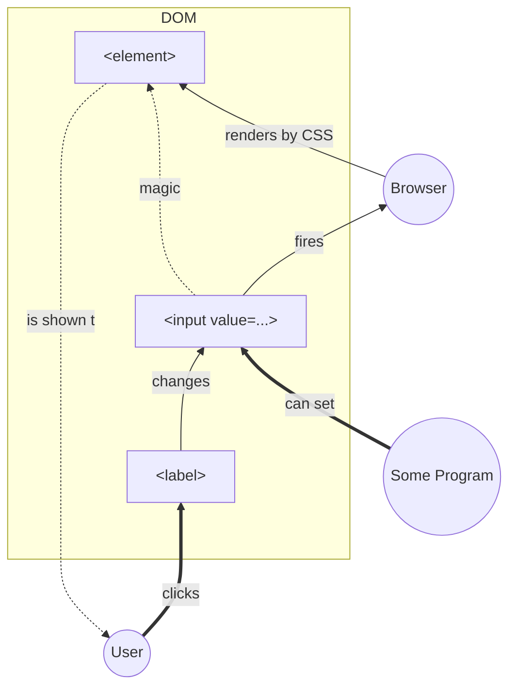
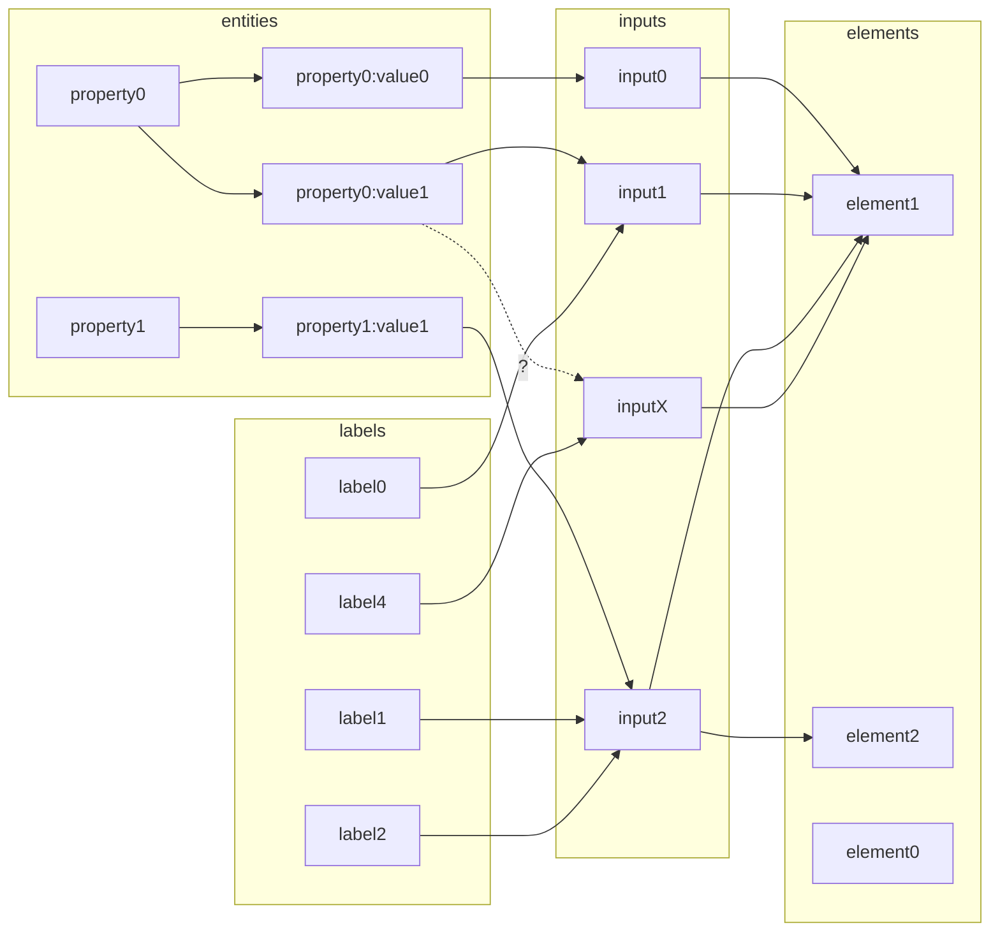

[TOC]

# Motivation

0. Pure CSS is good and powerful 
1. Modularity - UI and UX are separate instances both independent of BL
2. DOM is immutable

# Core Schema

Looks like pure M (input + browser + render) V (css) C (label)

- User ==clicks==> `<label>`
- `<label>` --changes--> `<input>`
- `<input>` --fires--> Browser
- Browser --renders by CSS--> `<element>`
- `<element>` -.is shown to.-> User



# Derivation

## ERM

- `entity`-`<input>` n-1 or 1-1
- `<label>`-`<input>` n-1

- `<input>`-`<element>` n-m




## Dependencies

```mermaid
graph LR

subgraph data
property
value
end

subgraph State2DOM
fId(("id(p, v)"))

subgraph <label>
for
end

subgraph <input>
id>id]
end

subgraph CSSRule
state["<b>if</b> (state.property <b>!==</b> value)<br>---<br>$identifier:not(:checked)"]
further["<b>then</b><br>---<br>+ ~ > *"]
target["element.style<br>---<br>$target"]
end

end

subgraph StyleDescription
body[":= {..}; <b>fi</b><br>---<br>{@content}"]
end

subgraph requirements
for-id{for-id}
$description{$description}
end


subgraph <element>
e.id>id]
className>className]
attr[data-*]
end

for --- for-id
id --- for-id

$description -.- e.id
$description -.- className
$description --> attr
target --> $description

state -.- further
further -.- target
target -.- body

property --> fId
value --> fId

fId ==> for-id
fId ==> state
fId ==> $description
```


# Research Overview

## [Dropdown](dropdown-radio/index.html)

1 enum state, 3*`<input type=radio>`. 

Substitution for not designable `<select>`.

## [Toggler](toggler/index.html)

1 boolean state, 1*`<input type=checkout>`.

Show/hide further elements.

## [Views](views/index.html)

1 boolean state, 1*`<input type=checkout>`.

Switching view between table with reordered columns and flow tile with specific item layout.

TBD: Like Google Drive's main page