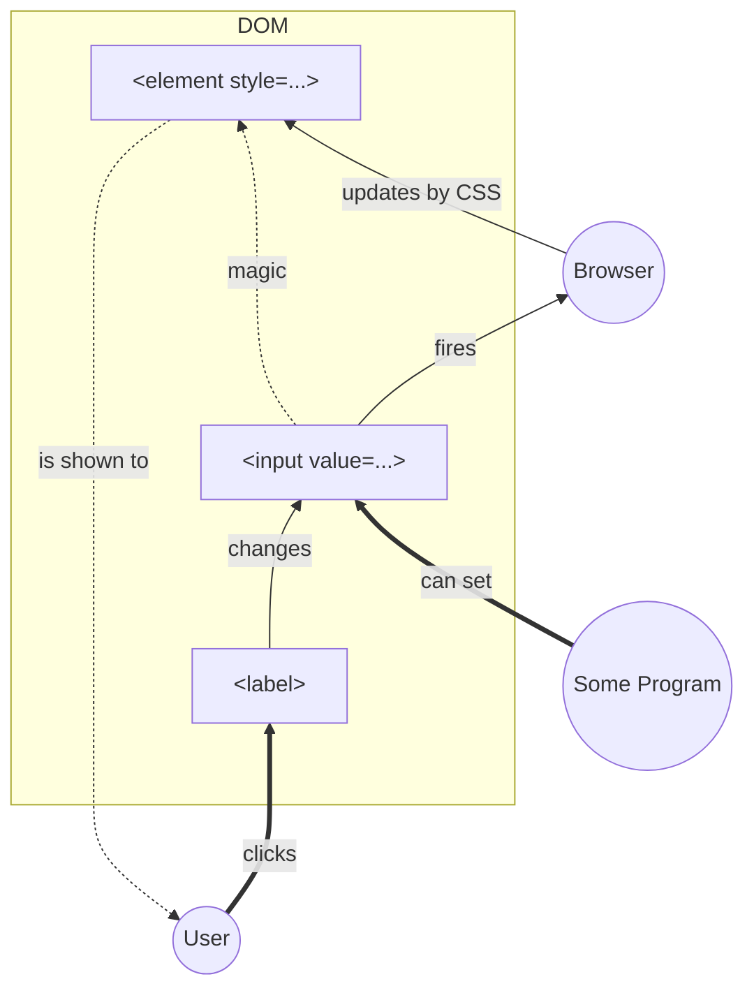

[TOC]

# Motivation

0. Pure CSS is good and powerful 
1. Modularity - UI and UX are separate instances both independent of BL
2. DOM is immutable

# Core Schema

# Research Overview

## [Dropdown](dropdown-radio/index.html)

1 enum state, 3*`<input type=radio>`. 

Substitution for not designable `<select>`.

## [Toggler](toggler/index.html)

1 boolean state, 1*`<input type=checkout>`.

Show/hide further elements.

## [Views](views/index.html)

1 boolean state, 1*`<input type=checkout>`.

Switching view between table with reordered columns and flow tile with specific item layout.

TBD: Like Google Drive's main page