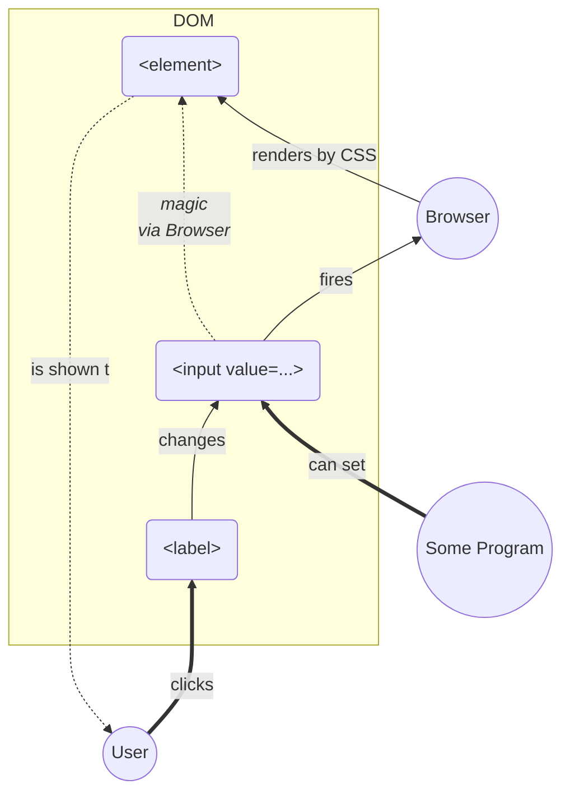

#  [Stateful DOM](https://askirmas.github.io/stateful-dom/index.html)

[TOC]

## Motivation

0. Pure CSS is good and powerful 
1. Modularity - UI and UX are separate instances both independent of BL
2. DOM is immutable

## Core Schema

Looks like pure M (input + browser + render) V (css) C (label)

- User ==clicks==> `<label>`
- `<label>` --changes--> `<input>`
- `<input>` --fires--> Browser
- Browser --renders by CSS--> `<element>`
- `<element>` -.is shown to.-> User



## Derivation

### ERM - Relations

- `entry`-`<input>`: 1-to-1 or 1-to-many
- `<label>`-`<input>` :many-to-1

- `<input>`-`<element>`: many-to-many

```mermaid
graph LR

property0 --> property0:value0
property0 --> property0:value1
property1 --> property1:value1

property0:value0 --> input0
property0:value1 -.?.-> inputX
property0:value1 --> input1
property1:value1 --> input2

label4 --> inputX
label0 --> input1
label1 --> input2
label2 --> input2

input0 --> element1
input1 --> element1
input2 --> element1
inputX --> element1
input2 --> element2

subgraph All possible Object.entries
property0:value0["[property0, value0]"]
property0:value1["[property0, value1]"]
property1:value1["[property1, value1]"]
end

subgraph <label>s
label4("&lt;label #4>")
label0("&lt;label #0>")
label1("&lt;label #1>")
label2("&lt;label #2>")
end

subgraph <input>s 
input0("&lt;input #0>")
inputX("&lt;input #X>")
input1("&lt;input #1>")
input2("&lt;input #2>")
end

subgraph <element>s
element1("&lt;element #1>")
element0("&lt;element #0>")
element2("&lt;element #2>")
end
```


### Dependencies

```mermaid
graph LR

subgraph data
property
value
end

subgraph State2DOM
fId(("id(p, v)"))

subgraph <label>
for
end

subgraph <input>
id>id]
end

subgraph CSSRule
state["<b>if</b> (state.property <b>!==</b> value)<br>---<br>$identifier:not(:checked)"]
further{"<b>then</b><br>---<br>+ ~ > *"}
target["element.style<br>---<br>$target"]
end

end

subgraph StyleDescription
body[":= {..}; <b>fi</b><br>---<br>{@content}"]
end

subgraph 
for-id{for-id}
$description{$description}
end


subgraph <element>
e.id>id]
className>className]
attr[data-*]
end

for --- for-id
id --- for-id

$description -.- e.id
$description -.- className
$description --> attr
target --> $description

state -.- further
further -.- target
target -.- body

property --> fId
value --> fId

fId ==> for-id
fId ==> state
fId ==> $description
```


## Research Overview

### [Dropdown](dropdown-radio/index.html)

1 enum state, 3*`<input type=radio>`. 

Substitution for not designable `<select>`.

### [Toggler](toggler/index.html)

1 boolean state, 1*`<input type=checkout>`.

Show/hide further elements.

### [Views](views/index.html)

1 boolean state, 1*`<input type=checkout>`.

Switching view between table with reordered columns and flow tile with specific item layout.

TBD: Like Google Drive's main page